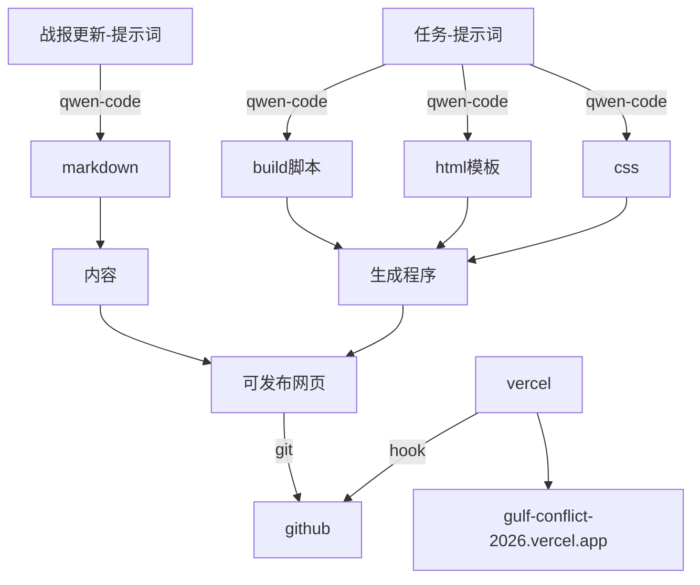

# gulf-conflict-2026

## 生成流程

```mermaid
flowchart TD
	A[战报更新-提示词] --qwen-code--> B[markdown] --> B1[内容]
	C[任务-提示词] --qwen-code--> D[build脚本]
	C[任务-提示词] --qwen-code--> E[html模板]
	C[任务-提示词] --qwen-code--> F[css]
	D --> G[生成程序]
	E --> G[生成程序]
	F --> G[生成程序]
	B1 --> H[可发布网页]
	G --> H[可发布网页]
	H --git--> I[github]
	
	V[vercel]  --hook--> I
	V --> S["gulf-conflict-2026.vercel.app"]
```